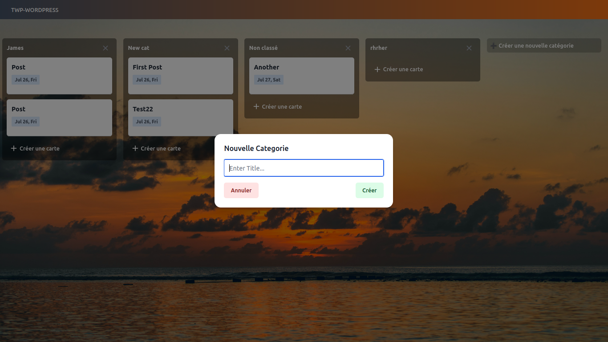

# Trello Post-it (TWP)

Une application web inspirée de Trello qui s'intègre avec WordPress via son API REST. L'application permet de gérer des tâches et des notes sous forme de tableaux kanban, en utilisant WordPress comme backend pour stocker les données.

## Description du Projet

"Trello Post-it" est une application web qui transforme WordPress en un système de gestion de tâches visuel de type Trello. L'interface utilisateur est développée avec Vue.js 3 et Tailwind CSS, offrant une expérience moderne et réactive similaire à Trello.

Le projet utilise l'architecture suivante :
- **Frontend** : Vue.js 3, Tailwind CSS, Pinia (pour la gestion d'état)
- **Backend** : WordPress REST API
- **Outils de développement** : Vite, ESLint, Prettier

## Fonctionnalités Principales

1. **Gestion des Tableaux Kanban**
   - Création, modification et suppression de listes (catégories WordPress)
   - Création, modification et suppression de cartes (articles WordPress)
   - Glisser-déposer des cartes entre les listes

2. **Intégration avec WordPress**
   - Les listes correspondent aux catégories WordPress
   - Les cartes correspondent aux articles WordPress
   - Authentification via JWT pour les opérations d'écriture

3. **Gestion des Commentaires**
   - Ajout de commentaires aux cartes (articles)
   - Modification et suppression des commentaires
   - Affichage des commentaires pour chaque carte

4. **Interface Utilisateur**
   - Interface inspirée de Trello avec un design moderne
   - Vue d'ensemble du tableau avec toutes les listes et cartes
   - Affichage détaillé des cartes avec leurs informations et commentaires
   - Navigation intuitive entre les différentes vues

5. **Fonctionnalités de Données**
   - Synchronisation en temps réel avec la base de données WordPress
   - Gestion des états avec Pinia pour une expérience utilisateur fluide
   - Persistance des données via l'API REST de WordPress

6. **Personnalisation**
   - Arrière-plan personnalisé pour le tableau
   - Interface adaptative pour différentes tailles d'écran

## Prérequis

- Node.js et npm
- Vue.js
- Tailwind CSS
- WordPress avec l'API REST activée
- Un token JWT valide pour l'authentification WordPress

## Installation

-   Clonez le contenu dans votre répertoire web de travail avec `git clone "repository"`
-   Démarrez votre WordPress avec `php -S localhost:<votre port>`
-   Modifiez votre token et remplacez votre localhost WordPress dans le store
-   Exécutez `npm install`
-   Exécutez `npm run dev`

# Usage

- Check that tailwind is installed in the project
- Check that wordpress is installed 
- Check that components are imported correctly

# Authors
1. This project was carried out by Daniel MEDEHOU project manager responsible for

   - Post and category crud and drag-and-drop management
   - Oragnisation and cordination of the team and Merging

   - Github : [Daniel MEDEHOU](https://github.com/Brandon22030)
   - Email : daniel.medehou@epitech.eu

2. Eddy KOUHOUENOU in charge of the admin dashboard ,classes for the functionalities and mobile responsiveness.
      
   * Github : [Eddy KOUHOUENOU](https://github.com/EddyKOUHOUENOU17)
   * Email : eddy.kouhouenou@epitech.eu

3.  Stone AFEDJOU in charge of comment crud management and post display
      
   * Github : [Stone AFEDJOU](https://github.com/stonefadel02)
   * Email : stone.afedjou@epitech.eu

 

# License

- This project is owned by Daniel MEDEHOU, Eddy KOUHOUENOU and Stone AFEDJOU 
- The project is open source but can't be used for illegal purposes.
